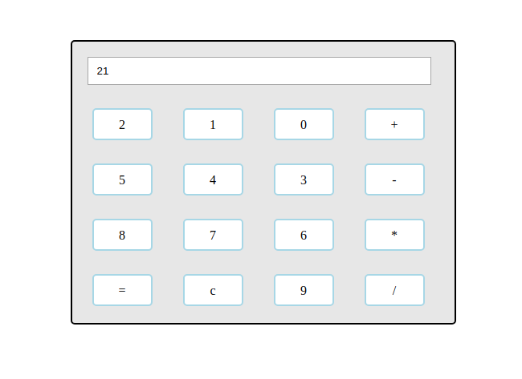

# Javascript-Calculator
> This is a Simple Javascript Calculator
<p align="center">
  
</p>

### Demo
[Demo](https://js-calculator.now.sh/)

### Feature
- Support Keyboard Key bindings;

### Keyboard
- Type 0 to 9 Numbers;
- Shift plus + : will add the Numbers;
- Shift plus * : will multiply the Numbers;
- -: will subtract the Numbers;
- / : will divide the Numbers;
- = : will give the Output;
- backspace : will clear the values;

### Options

| Name     | Description    | Type     |
|----------|----------------|----------|
|background | change the calculator background | String |
|numbersBackground | change the numbers box background | String |
|numbersColor | change the numbers box color | String |
|operatorsBackground | change the operators box background | String |
|operatorsColor | change the operators box color | String |
|clearAndEqualBackgrounds | change the clear and equal box background | String |
|clearAndEqualColors | change the clear and equal box color | String |

## Note
#### Add index.js to your html file

## Example
```html
<!DOCTYPE html>
<html lang="en">
<head>
    <meta charset="UTF-8">
    <meta name="viewport" content="width=device-width, initial-scale=1.0">
    <meta http-equiv="X-UA-Compatible" content="ie=edge">
    <title>Calculator</title>
    <script src="../node_modules/src/index.js"></script>
</head>
<body>
</body>
</html>
```


Step 1: add some class to the div.

```html
<div class="wrapper"></div>
```

Step 2: Initialize the plugin on your page. For example

```javascript
// initialize with defaults
$(".wrapper").javascriptCalcInit();

// initialize with options
$(".wrapper").javascriptCalcInit({
        background:'black',
        numbersBackground:'#8c4141',
        numbersColor:'white',
        operatorsBackground:'#FF5722',
        operatorsColor:'white',
        clearAndEqualBackgrounds:'#8c4141',
        clearAndEqualColors:'white',
});
```
### Using NPM
To install using the `npm` package manager run:

`$ npm install javascript-calculator`

## Contribute

Contributions are always welcome!